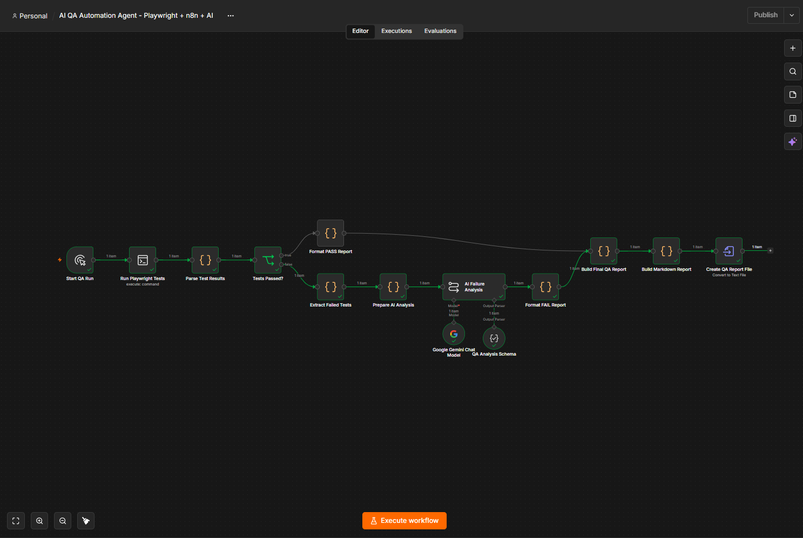
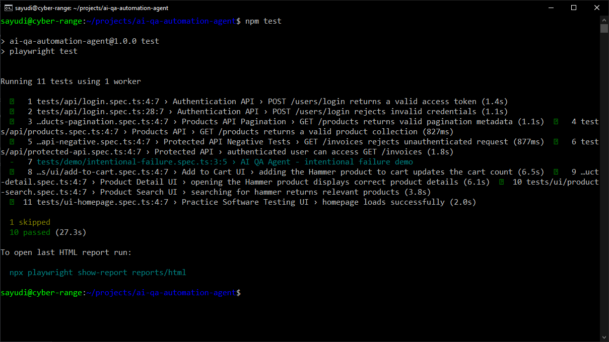
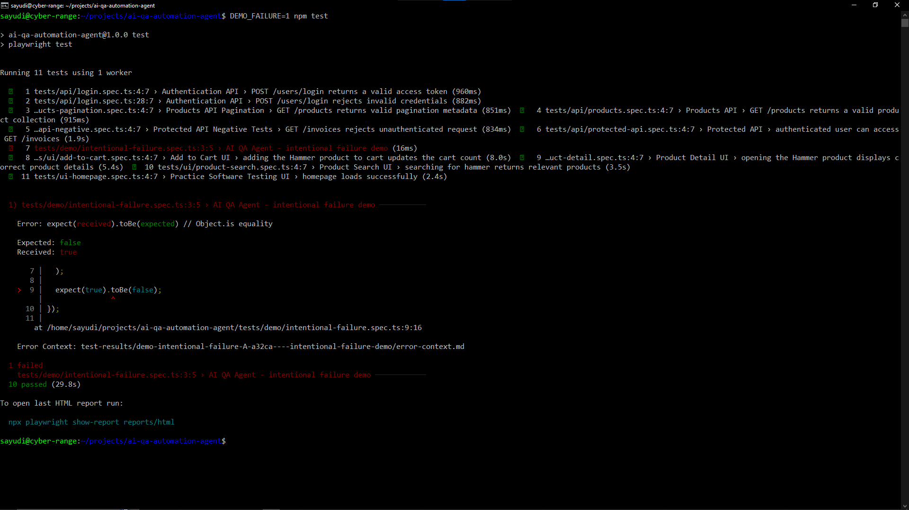
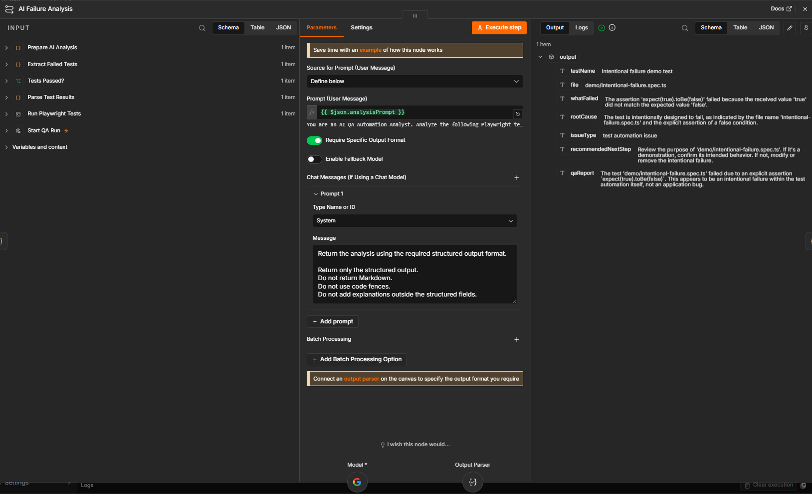
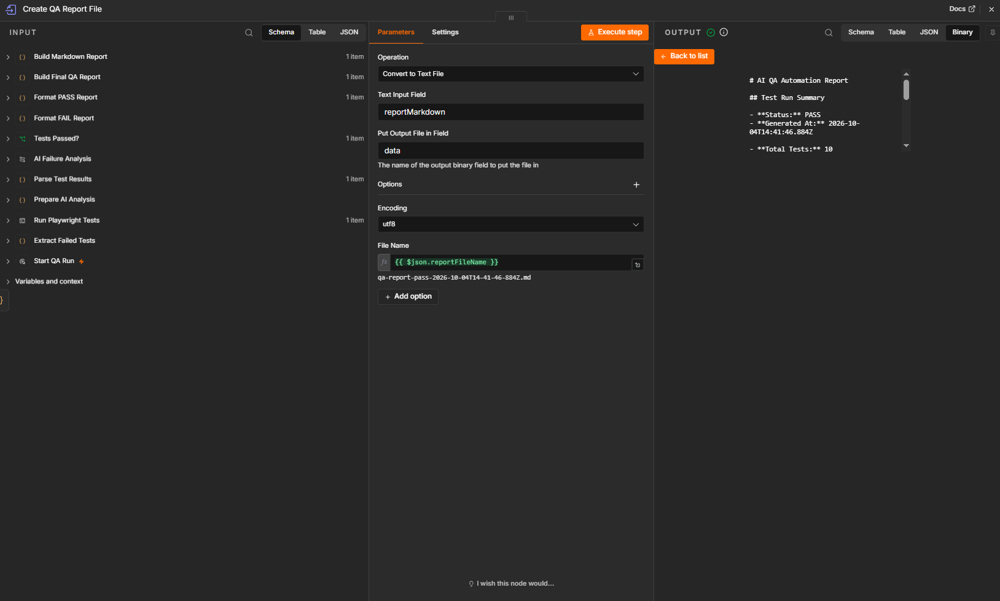
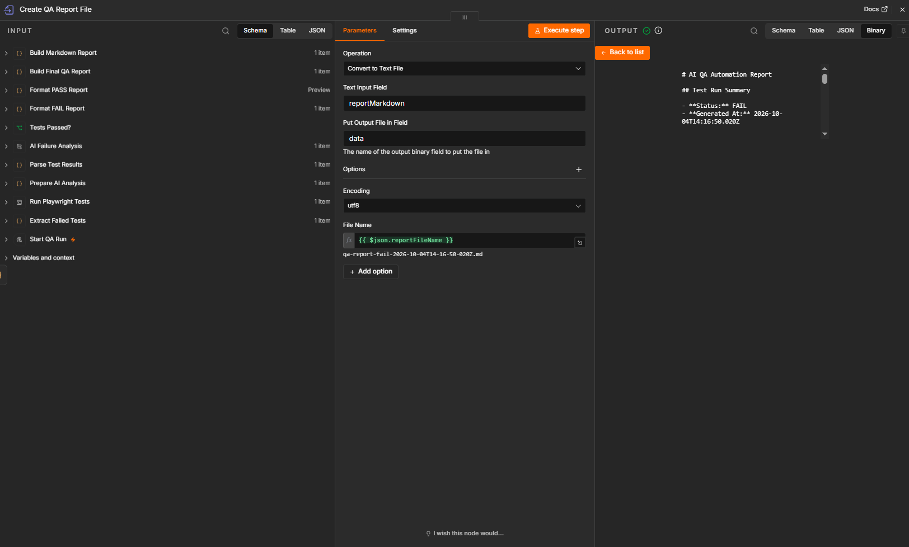

# AI QA Automation Agent

> **AI-assisted end-to-end QA automation using Playwright, n8n, Ubuntu, SSH, and Google Gemini.**

[](https://playwright.dev/)
[](https://nodejs.org/)
[](https://n8n.io/)
[](https://ai.google.dev/)

An automation-engineering project connecting automated API/UI testing, remote Linux execution, workflow orchestration, AI-assisted failure analysis, and automated QA reporting.



## System Under Test

This project tests **Practice Software Testing – Toolshop**, a public e-commerce demo application created for software-testing training.

- **Web application:** https://practicesoftwaretesting.com/
- **API under test:** https://api.practicesoftwaretesting.com/
- **API documentation:** https://api.practicesoftwaretesting.com/api/documentation

The application exposes e-commerce flows such as authentication, product search, product details, protected invoice access, and cart behavior.

> The target is a public training/demo application, not a production system.

## What this project demonstrates

```text
Test execution
      ↓
Machine-readable result
      ↓
PASS / FAIL decision
      ↓
Failure extraction
      ↓
AI-assisted diagnosis
      ↓
QA report generation
```

The execution result remains the source of truth. Gemini is used only after a failure has been detected.

## Architecture

```text
n8n
 ↓ SSH
Ubuntu / Node.js / Playwright
 ↓
Practice Software Testing
 ↓
reports/test-results.json
 ↓
Parse Test Results
 ↓
Tests Passed?
 ├─ PASS → Format PASS Report
 └─ FAIL → Extract Failed Tests
            ↓
         Prepare AI Analysis
            ↓
         Gemini Failure Analysis
            ↓
         Format FAIL Report
            ↓
            └──────┐
                   ↓
            Build Final QA Report
                   ↓
            Create Markdown File
```

See [Technical Design](docs/technical-design.md) for the implementation details.

## Verified results

| Scenario | Result |
|---|---|
| PASS | **10 passed, 0 failed, 1 skipped** |
| FAIL | **1 controlled failure extracted and analyzed by AI** |
| Output | **Markdown QA report generated** |

### PASS evidence



### FAIL evidence

The deterministic demo failure is enabled only with:

```bash
DEMO_FAILURE=1 npm test
```

```ts
expect(true).toBe(false);
```





## Generated QA reports

### PASS



### FAIL



## Test coverage

### API

| Test file | Scenario |
|---|---|
| `tests/api/login.spec.ts` | Valid login and invalid-credential rejection |
| `tests/api/products.spec.ts` | Product collection response |
| `tests/api/products-pagination.spec.ts` | Pagination metadata |
| `tests/api/protected-api.spec.ts` | Authenticated protected endpoint |
| `tests/api/protected-api-negative.spec.ts` | Unauthenticated protected endpoint rejection |

### UI

| Test file | Scenario |
|---|---|
| `tests/ui-homepage.spec.ts` | Homepage load |
| `tests/ui/product-search.spec.ts` | Product search |
| `tests/ui/product-detail.spec.ts` | Product detail |
| `tests/ui/add-to-cart.spec.ts` | Add-to-cart behavior |

### Controlled failure

`tests/demo/intentional-failure.spec.ts` exists specifically to validate the n8n FAIL + AI analysis path.

## Technical highlights

### Remote execution

n8n runs Playwright on the Ubuntu host over SSH:

```text
Windows / Docker / n8n
        │
        │ SSH
        ▼
Ubuntu / Playwright
```

### Exit-code preservation

The SSH command captures the actual Playwright exit code, emits it as a marker, emits the JSON report between markers, and then exits 0 so the n8n data pipeline can continue.

```bash
source ~/.nvm/nvm.sh && nvm use 22 >/dev/null && npm test; TEST_EXIT=$?; echo "__TEST_EXIT_CODE__=$TEST_EXIT"; echo "__TEST_RESULTS_JSON_START__"; cat reports/test-results.json; echo "__TEST_RESULTS_JSON_END__"; exit 0
```

The routing decision is:

```text
testExitCode = 0
    → PASS

testExitCode != 0
    → FAIL
```

### Recursive failure extraction

Playwright JSON can nest suites and specs at different levels. The failure extractor recursively walks the suite tree and collects failed results, including file, line/column, duration, error message, stack, snippet, and error location.

### AI boundary

Gemini does not decide whether the test run passed.

```text
Playwright result
      ↓
n8n PASS/FAIL gate
      ↓
FAIL only
      ↓
Gemini diagnosis
```

### Structured AI output

The AI returns structured fields for:

- what failed
- root cause
- issue type
- recommended next debugging step
- QA report summary

### Shared reporting

```text
PASS → Format PASS Report ─┐
                           ├→ Final QA Report
FAIL → Format FAIL Report ─┘
```

## Tech stack

| Layer | Technology |
|---|---|
| Test automation | Playwright 1.63.0 |
| Language | TypeScript |
| Runtime | Node.js 22.x |
| SUT | Practice Software Testing – Toolshop |
| Test environment | Ubuntu 24.04.4 LTS |
| Remote execution | SSH |
| Orchestration | n8n |
| AI analysis | Google Gemini |
| Report format | Markdown |
| Reporters | List, HTML, JSON, JUnit |

## Getting started

```bash
npm install
npx playwright install --with-deps chromium
npm test
```

Controlled failure demo:

```bash
DEMO_FAILURE=1 npm test
```

Run an individual test:

```bash
npx playwright test tests/api/products.spec.ts
```

## Repository structure

```text
ai-qa-automation-agent/
├── README.md
├── .gitignore
├── package.json
├── package-lock.json
├── playwright.config.ts
├── tests/
│   ├── api/
│   ├── ui/
│   └── demo/
├── workflow/
│   ├── README.md
│   └── ai-qa-automation-agent.json
└── docs/
    ├── architecture.md
    ├── testing.md
    ├── technical-design.md
    ├── test-strategy.md
    ├── portfolio.md
    ├── GITHUB-PUBLISHING.md
    └── screenshots/
```

Runtime output such as `node_modules/`, `reports/`, and `test-results/` is intentionally excluded from Git.

## Security

Do not commit API keys, access tokens, passwords, SSH private keys, webhook secrets, database credentials, or `.env` files containing secrets.

n8n credentials should be configured in the n8n instance, not stored as plaintext in the repository.

## Current scope

Implemented:

- API test automation
- UI test automation
- remote Linux execution
- Playwright JSON parsing
- PASS/FAIL routing
- recursive failure extraction
- Gemini-assisted failure analysis
- structured QA output
- Markdown report generation
- PASS and FAIL validation evidence

Not implemented:

- GitHub Actions CI/CD
- environment provisioning
- self-healing selectors
- production alerting/messaging
- WhatsApp integration
- production deployment

## Documentation

- [Technical Design](docs/technical-design.md)
- [Test Strategy](docs/test-strategy.md)
- [GitHub Publishing Checklist](docs/GITHUB-PUBLISHING.md)

## QA Reports

Generated QA report artifacts from the automation pipeline:

- [PASS QA Report](reports/qa-report-pass.md)
- [FAIL QA Report](reports/qa-report-fail.md)

The PASS report demonstrates a successful Playwright test run with 10 executed tests, 0 failures, 1 skipped test, and 0 flaky tests. The FAIL report demonstrates the controlled `intentional-failure` scenario and the resulting AI-assisted failure classification.

## Author

**Muhammad Sayudi Putra**
Automation Engineer focused on QA Automation, n8n, AI, APIs, and software testing.

- GitHub: [Sayudi-P](https://github.com/Sayudi-P)
